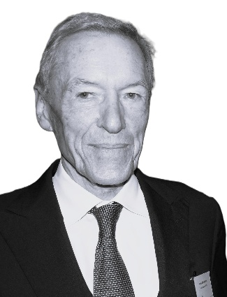
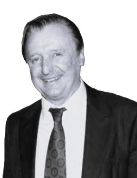
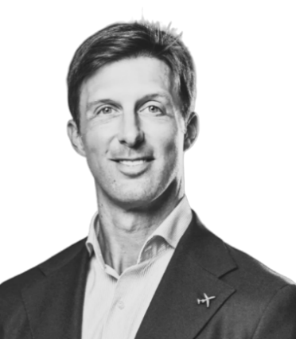
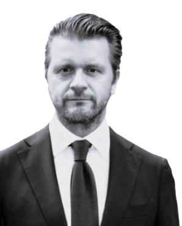
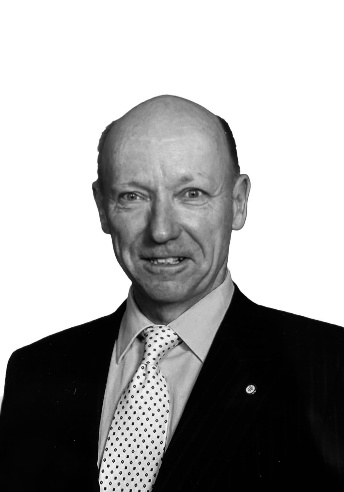
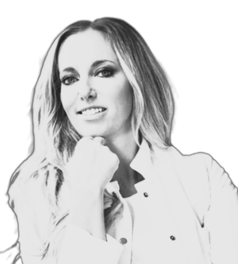

**ABOUT US**

All the same size and font, just for illustration
purposes we changed the font size

<u>HEADER:</u> “We founded this investment strategy to offer
forward-looking investors a way to benefit from the structural forces
shaping the next decades - responsibly and with precision.”

<u>Portfolio Management</u>

SW KW

Bio (link) Bio (link)

<u>HEADER:</u> “Our Advisory Board strengthens our investment strategy
through seasoned judgment, independent perspective, and extensive
experience across markets, industries, and economic cycles.”

<u>Advisory Board</u>

**Alois J. Wiederkehr Karl Bieri** **Dominik Burkart**

**Senior Advisor to the Fund Mobility and Transportation Expert Economic
Power Shifts Expert**

Bio (link) Bio (link) Bio (link)

**Julius Hargitai Jens Kruse Dr. med. univ. Bianca Sacherer**

**Smart Infrastructure Expert Technology and AI Expert Healthcare and
Longevity Expert**

Bio (link) Bio (link) Bio (link)

Can you please improve phot quality to match the one
of SW and KW

**Alois J. Wiederkehr**

**Senior Advisor to the Fund**

Bio Link Text:

Alois founded our Family Office in 1989, establishing a principled,
multi-generational foundation for capital stewardship. As a Member of
the Advisory Board and Senior Advisor to the fund, he brings decades of
experience advising UHNW individuals and entrepreneurial families in
private banking, cross-border wealth structuring, and long-term asset
management, guided by discretion, fiduciary responsibility, and a strong
commitment to legacy preservation.

With his comprehensive understanding of international capital markets
and international ownership structures, Alois shapes our investment
orientation through a philosophy centered on preservation, measured
growth, and intergenerational continuity. His perspective reflects
prudence, consistency, and a deep respect for legacy, ensuring stability
across market cycles. He is fluent in German, English, French, and
Spanish, and maintains longstanding relationships within global
financial and entrepreneurial circles.

**Karl Bieri**

**Mobility and Transportation Expert**

Bio Link Text:

Karl is a leading expert in the automotive industry, with longstanding
experience in electrification, mobility innovation, and the evolving
global transportation ecosystem. He is the co-founder and Chairman of
the Board of Auto Zürich AG, the largest automotive trade show in
Switzerland. As a Member of the Advisory Board, he contributes extensive
industry expertise and strategic insight into technological
transformation, competitive positioning, and long-term sector
developments across the automotive value chain.

With his comprehensive understanding of international mobility markets
and complex industry structures, Karl supports our investment
orientation through a disciplined assessment of structural trends,
innovation cycles, and capital allocation opportunities. His perspective
combines forward-looking analysis with practical industry engagement,
ensuring informed positioning within a rapidly evolving sector. He is
fluent in German and English and maintains a well-established
international automotive network

**Dominik Burkart**  
**Economic Power Shifts Expert**

Bio Link Text:

Dominik is a Member of the Board of Directors of Pilatus Aircraft Ltd,
where he has been serving since 2014. In this role, he contributes to
key strategic decisions, including international expansion and long-term
development. As a member of the Advisory Board, he brings expertise in
economic power shifts with a particular focus on ownership structures,
capital allocation, and sustainable value creation.

His background in finance and investments, combined with his
understanding of economic dynamics and industrial value chains, provides
valuable insight into structural transformations shaping markets.
Drawing on this expertise, he supports the fund’s investment orientation
through a disciplined assessment of geopolitical developments, regional
growth dynamics, and evolving capital flows. He is fluent in German and
English.

**Julius Hargitai**

**Smart Infrastructure Expert**

Bio Link Text:

Julius founded Financial Intermediary KKJ Company, a boutique financial
intermediary specializing in private placements and off-market
investment opportunities across Europe and Southeast Asia. The firm
connects investors with high-potential real estate and infrastructure
assets while enabling early- and growth-stage companies to access
capital through targeted and efficient investment matchmaking. As a
member of the Advisory Board, he brings analytical depth and expertise
in organizational design, behavioral economics, and executive decision
architecture.

Through his experience in governance, incentive alignment, and strategic
execution, Julius helps strengthen the robustness of our operating
framework. His insights into complex decision environments support
disciplined strategic processes and the organization’s long-term
positioning in smart infrastructure, smart cities, and technology-driven
urban ecosystems. He is fluent in German, English, and Hungarian.

Bio Link Text:

**Jens Kruse**

**Technology and AI Expert**

Jens is Co-Manager of a global equity portfolio at Chi Fu Investments
Group in Zürich. Chi Fu Investments is a multinational financial holding
company headquartered in Shanghai, with offices in Taipei, Hong Kong,
Budapest, and New York. Jens joined the firm in 2018. As a member of the
Advisory Board, Jens brings more than three decades of experience in
global equity markets and the international asset management industry.

His extensive background in portfolio management, institutional
distribution, and strategic market development, combined with his broad
international network across the financial industry, provides valuable
insight into evolving investment landscapes and investor expectations.
Drawing on his experience and global network, he supports the
organization’s tactical positioning with a particular focus on
technological innovation, artificial intelligence, and data-driven
investment and decision frameworks. Jens is fluent in German, English,
French, and Italian.

**Dr. med. univ. Bianca Sacherer**

**Healthcare and Longevity Expert**

Bio Link Text:

Bianca founded Med for Balance, a boutique medical practice dedicated to
individualized and integrative care. Her work is guided by the principle
that vitality, well-being, and natural beauty are closely interconnected
and best achieved through balance and a holistic understanding of the
body. As a member of the Advisory Board, she contributes expertise in
preventive health, longevity, and personalized treatment concepts,
offering perspectives on healthcare innovation and evolving demographic
trends.

As Medical Director of her practice, she provides highly individualized
care tailored to the needs of her patients. Her clinical work combines
classical internal medicine with bioidentical hormone therapy and
individualized better aging concepts, complemented by elements of
traditional Chinese medicine as well as specialized supplements,
infusion therapies, and aesthetic treatments. She is fluent in German
and English.
